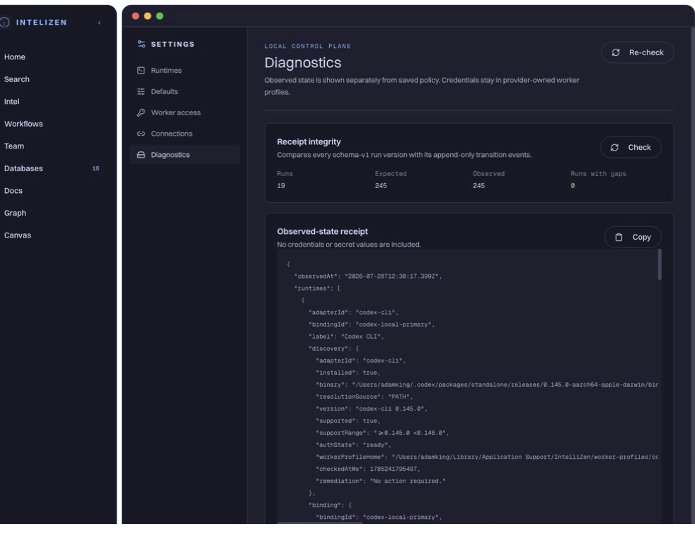

# V2 backend audit remediation

Date: 2026-07-28
Source audit: `/Users/adamking/projects/intellizen-app-v2/docs/audits/v2-backend-code-review-2026-07-28.md`
Implementation branch: `v2-integration`

## Disposition of the amended audit

The amended audit is the controlling review. Its corrections were preserved:

- The original C2 finding is withdrawn. Empty model allowlists remain deny-all,
  and model-policy failures are reported as typed blockers.
- The retry state machine remains. Pre-spawn failures may be retried; failures
  after a worker starts remain ambiguous and non-retryable.
- Gate 7 remains real operational evidence, but is not represented as a
  repeatable automated check.
- Graph is not implemented with React Flow. The workflow topology surface does
  use the shared `@xyflow/react` spatial model, so no replacement was required.

## Correctness and product repairs

- Workflow completion idempotency now uses the current run version.
- Rejected dispatch and recovery promises are evicted so later retries can run.
- Role blockers are typed, and the local review fixture cannot become a
  dispatch-ready role.
- Database Peek derives runnable workflows and role targets from actual
  workflow and role state.
- Section-only record updates no longer rewrite a stale record body.
- Hermes polling accepts cancellation propagated through workflow dispatch,
  cleans up poll listeners, and treats missing or unknown terminal state as a
  failure instead of success. Cancellation stops the local wait and is handled
  as ambiguous delivery; it does not claim the remote Hermes run was cancelled.
- Runtime chat surfaces provider events and protocol/runtime diagnostics.
- Runtime authentication distinguishes `ready`, `login_required`,
  `config_invalid`, `unknown`, and `unavailable`; the Rust classifier has unit
  coverage.
- Active work rejects unknown statuses and matches role ownership plus the
  exact persisted actor forms currently present in run history: record ID,
  agent key, or display name. It does not use case-folded fuzzy identity.
- The built-in Fiona binding is centralized and participates in the effective
  binding catalog.

## Security and migration repairs

- Local filenames for the two already-applied migrations now match the remote
  migration versions and carry explicit remote-version receipts:
  `20260703090922` and `20260727092636`.
- Credential material was removed from the active migration sources. An older
  committed migration still contains the previous access-key hash, so key
  rotation and any separately approved history remediation remain release
  blockers. Admin runtime variables are provisioned by
  `scripts/provision-admin-runtime-env.sh` into the native application-support
  environment with mode `0600`.
- Append-only receipt permissions and RPC execution privileges are hardened in
  `20260728114149_harden_append_only_receipt_permissions.sql`, with explicit
  `anon` and `service_role` execution retained after broad grants are revoked.
- Consequential record changes and their work-event receipts are committed by
  one transactional RPC in
  `20260728115305_transactional_consequential_work_receipts.sql`.
- Settings transition coverage detects schema-v1 run versions written outside
  the transactional transition RPC or missing from append-only history. It
  does not validate best-effort telemetry, consequential section/event writes,
  or receipt content.

The two 20260728 migrations are intentionally local and pending. They were not
applied to production because this session had no production-application
approval.

## Structural progress

- Persistence, chat transport, and voice logic were extracted from the Agent
  Panel with focused unit tests. The coordinator remains 2,371 lines and its
  full structural audit target is not complete.
- Static render coverage exercises the extracted presentational shell/state
  contracts across collapsed, docked, standalone, loading, ready, working,
  blocked, unavailable, offline, empty, and error states. It is not an
  integrated mount test of `agent-panel.tsx`.
- Sandbox query, OSINT, and work-receipt data access moved out of the legacy
  `data.ts` hub while the existing import surface remains compatible.
- Unreferenced legacy views, settings components, UI primitives, and the dead
  Hermes service were removed.
- `pnpm check` now includes a source-file size gate. Existing large files are
  explicitly ratcheted; new unapproved files over the limit fail the check.
- Route, implementation, test-count, migration, and Gate 7 documentation were
  corrected to match the repository.

Remaining structural debt includes further Agent Panel coordination extraction,
continued decomposition of the legacy `data.ts` hub, and large Graph modules.

## Verification receipt

- `pnpm check`: passed; 307 source files checked, 15 ratcheted exceptions.
- `pnpm test`: 53 files passed, 1 skipped; 252 tests passed, 1 skipped.
- `VITE_INTELLIZEN_LOCAL_ACCESS_KEY= pnpm smoke`: passed, including file-size
  gate, TypeScript, Clippy with warnings denied, production build, and Rust
  tests.
- `pnpm --dir mcp-server test`: 12 tests passed.
- `pnpm --dir mcp-server build`: passed.
- `cargo test --manifest-path src-tauri/Cargo.toml`: 21 tests passed.
- `git diff --check`: passed.
- `scripts/check-bundle-secrets.sh dist`: passed; no service-role JWT was found.
- Unsigned local debug app build:
  `/Users/adamking/projects/intellizen-app/src-tauri/target/debug/bundle/macos/IntelliZen.app`.
- Native diagnostic readback before the wording correction: 19 schema-v1 runs,
  245 expected transition versions, 245 observed, 0 runs missing versions.

No production migration, deployment, push, pull request, DMG, signed build, or
release was performed.
